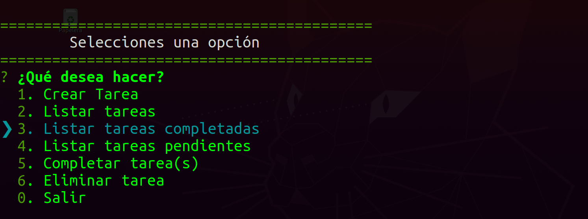
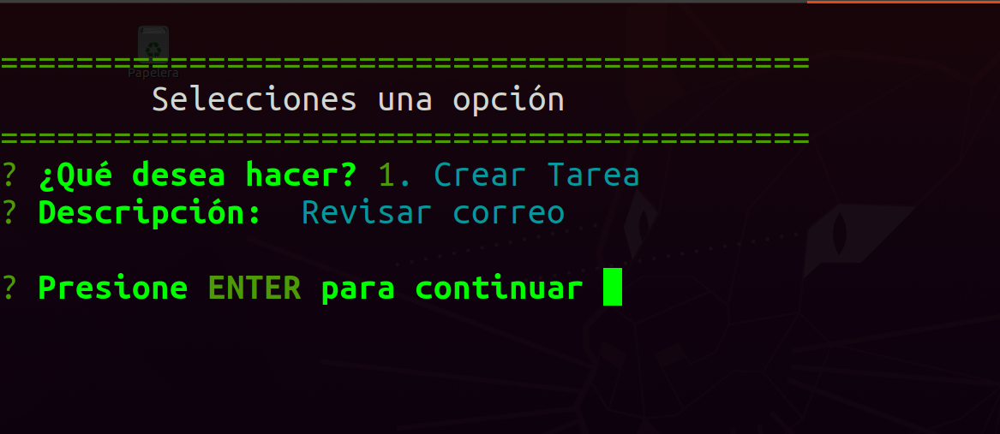
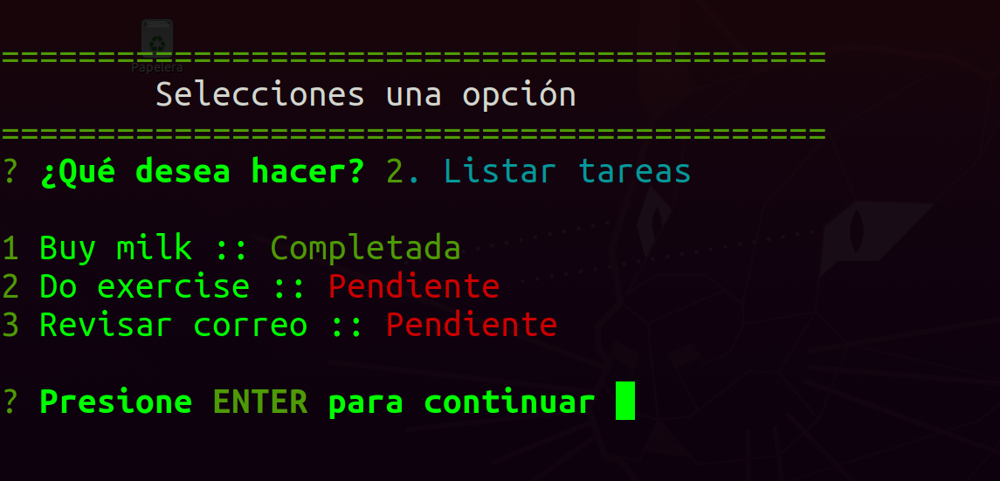
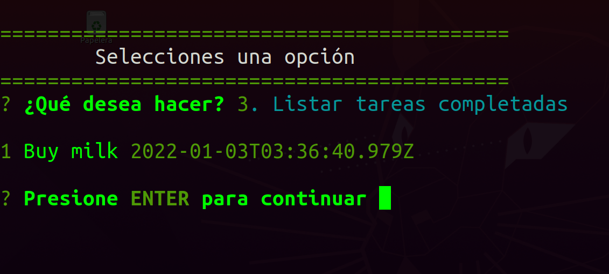
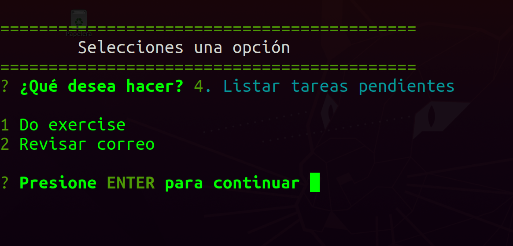
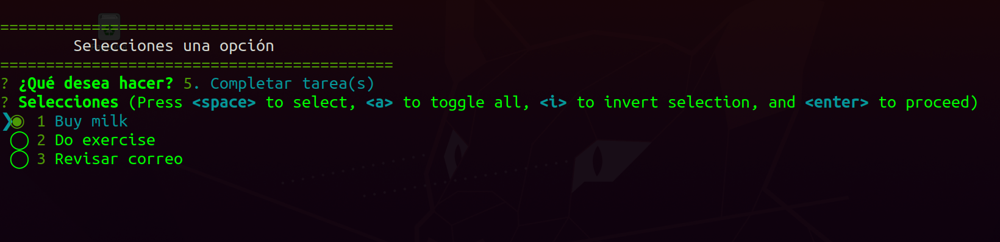
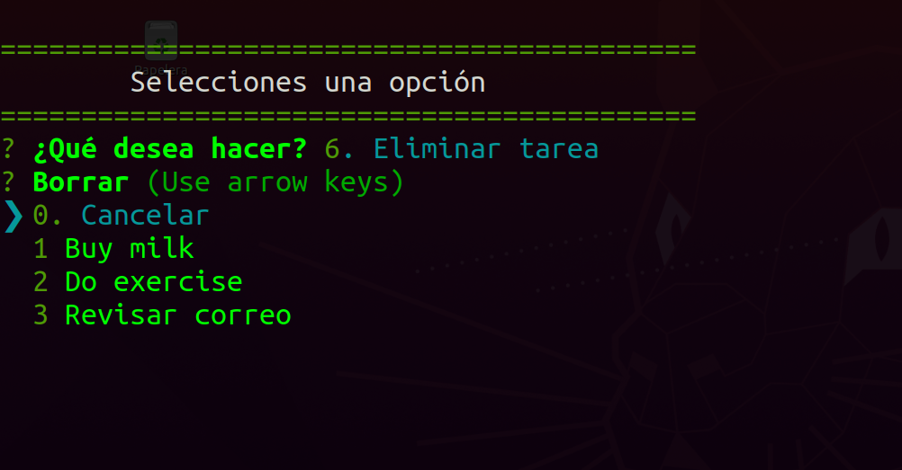

# node-to_do_app

Esta es una simple ToDo-App hecha en Nodejs

Menu:

Crear Tarea:

Listar Tareas:

Listar Tareas Completas:

Listar Tareas Pendientes:

Comppletar Tareas

Eliminar Tareas:

LinkedIn: [maguilera-jaramillo](https://www.linkedin.com/in/maguilera-jaramillo/)